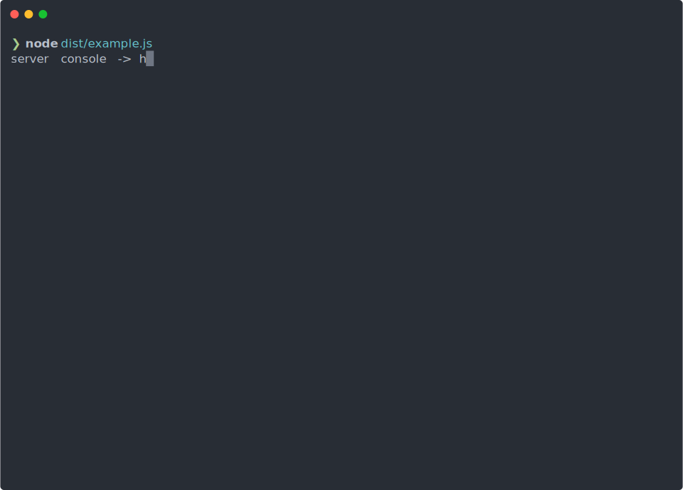

<p align="center">
  
</p>

# Cliffy - A Framework For Interactive CLIs

Cliffy is a simple, powerful utility for making interactive command line interfaces.

Cliffy is run as a REPL. This allows you to accept multiple commands
with one running node process. Cliffy is NOT an argv parser.

**Features**:
- REPL Style interface
- Simple API
- Can parse negative numbers
- Typed parameters
- Git Style Sub-Commands
- Optional parameters  (New in v2)
- Rest parameters (New in v2)
- Options
- Auto generated help
- Typescript Support

**Gotchas**:
- Options are specified with an `@` symbol. Not `-` or `--`.
This is what allows Cliffy to parse negatives.
- Requires node v6+

## Quickstart

**Installation**:

```bash
npm i cliffy # --save if using npm < v5
```

**Usage**

```typescript
import { CLI } from "cliffy";

const cli = new CLI();
    .setDelimiter("-->")
    .command("run", {
        description: "Run somewhere",
        options: [{ label: "quickly", description: "Run quickly" }],
        parameters: ["destination"],
        action: (params, options) => {
            if (options.quickly) {
                console.log(`I ran to ${params.destination} quickly`)
            }

            console.log(`I ran to ${params.destination}`)
        },
        subcommands: {
            to: {
                description: "Run to a destination",
                parameters: ["destination"],
                action: params => console.log(`I ran to ${params.destination}`)
            }
            from: {
                description: "Run from a destination",
                parameters: ["location"],
                action: params => console.log(`I ran from ${params.location}`)
            }
        }
    })
    .show();
```

Result:

```bash
--> run to nevada
I ran to nevada
--> help

Available commands:

    run [options]  <destination>    Run somewhere

--> help run

Run somewhere

Usage:

    run [options] <destination>

Options:

   @quickly                          Run quickly

Sub-Commands:

    to [options] <destination>       Run to a destination
    from [options] <destination>     Run from a destination
```

## API

### `new CLI()`

Interface:
```typescript
class CLI {
    constructor(opts: {
        input?: NodeJS.ReadableStream,
        output?: NodeJS.WritableStream
    } = {})
}
```

Usage:

```typescript
const cli = new CLI(opts)
```

### `cli.addCommand(name: string, command: Command): this`

Register a command

Takes a name and a command object.

The command name is what the user will enter to execute the command.

The command interface is defined as follows:

```typescript
interface Command {
    /**
     * The action to perform when its command is called.
     *
     * parameters is a key value store. Where the key is the parameter label,
     * and its value is the value entered by the user.
     *
     * options is a key value store. Key being the option, value being true if the user
     * specified the option, false otherwise.
     */
    action(parameters: any, options: { [key: string]: boolean }): void | Promise<void>;

    /** Optional description for documentation */
    description?: string;

    /**
     * An array of options available to the user.
     * The user specifies an option with an @ symbol i.e. @force
     */
    options?: (Option | string)[];

    /**
     * All the parameters available to the user.
     * See the parameters interface.
     *
     * If a string is passed it is assumed to be string parameter
     */
    parameters?: (Parameter | string)[];

    /** Sub commands of the command. Follows the same interface as Command */
    subcommands?: Commands;
}

export interface Parameter {
    label: string;

    /** The type to convert the provided value to. Can be a custom converter. */
    type?: "boolean" | "number" | "string" | ((val: string) => any);

    /** The parameter is optional */
    optional?: boolean;

    /**
     * The parameter is a rest parameter.
     *
     * If true, the user can pass an indefinite amount of arguments
     * that are put in an array set in this parameter.
     **/
    rest?: boolean;

    /** Optional description for the help menu */
    description?: string;
}

export interface Option {
    label: string;
    description?: string;
}
```

Example Usage:

```typescript
cli.command("run", {
    description: "Run somewhere",
    options: [{ option: "fast", description: "Run fast" }],
    parameters: [{ label: "destination" }],
    action: (params, options) => {
        if (options.fast) return console.log(`I ran to ${params.destination} quickly`);
        console.log(`I ran to ${params.destination}`);
    },
    subcommands: {
        to: {
            parameters: [{ label: "destination" }],
            action: params => console.log(`I ran to ${params.destination}`),
        }
        from: {
            parameters: [{ label: "destination" }],
            action: params => console.log(`I ran to ${params.destination}),
        }
    }
});
```

### `cli.addCommand(name: string, opts: Action): this`

Register a basic command.

This overload allows you to pass the action function directy.
Useful for quick commands where parameters, options, and a
description may not be needed.

Example usage:

```typescript
cli.command("speak", () => sayHello("World"));
```

### `cli.addCommands(commands: { [name: string]: Command | Action }): this`

Register multiple commands at once.

Example usage:

```typescript
cli.commands({
    run: {
        action(params, options) {
            console.log("Running");
        }
    },

    jog: {
        action(params, options) {
            console.log("Jogging");
        }
    },

    walk: {
        action(params, options) {
            console.log("Walking");
        }
    }
});
```

### `cli.setDelimiter(delimiter: string): this`

Set the CLI delimiter

Defaults to: `"$>"`

### `cli.setInfo(info: string): this`

Set the CLI info.

Info is meant to give an overview of what the CLI does and how to use it.
If it is set it is shown directly under the CLI name.

Defaults to: `none`

### `cli.setName(name: string): this`

Set the name of the CLI (Shown at the top of the help menu)

Defaults to: `none`

### `cli.setVersion(version: string): this`

Set the CLI version. Shown beside the CLI name if set.

Defaults to: `none`

### `cli.show(): this`

Show the CLI

### `cli.hide(): this`

Hide the cli

## Autogenerated Help Menu

Cliffy automatically generates a help menu for each command.

To get an overview of all the commands simply type:

```
help
```

To get help with a specific command, type help followed by the command.

```
help ls
```

This works with subcommands as well

```
help git pull
```

## Build instructions

1. Clone this repo
2. CD into the repo
3. `npm install`
4. `npm run build`
